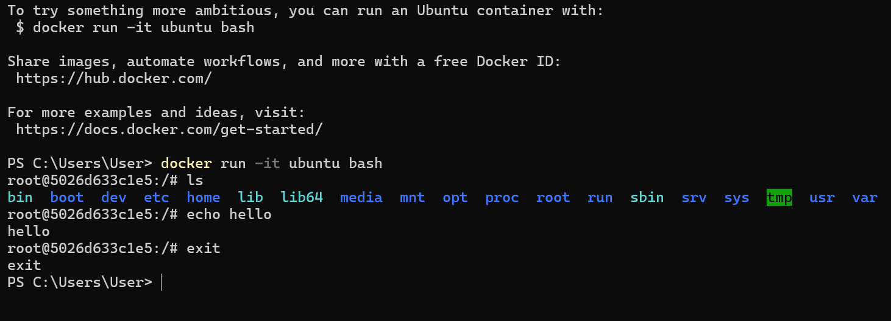
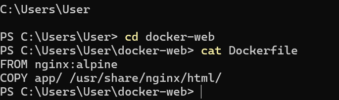
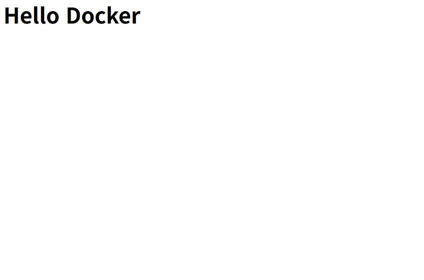
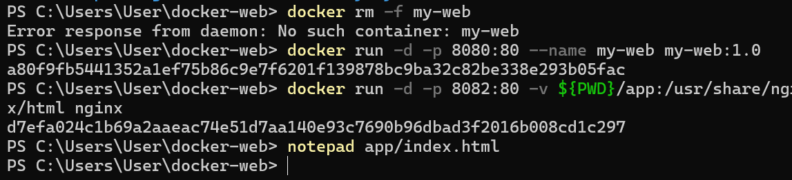
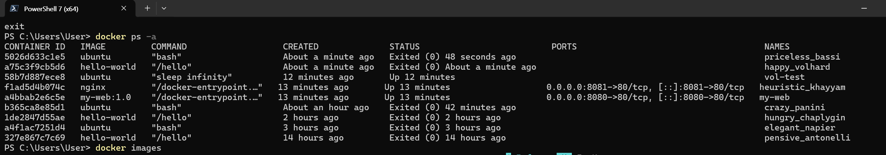
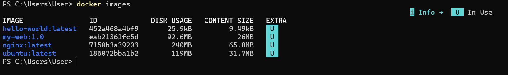

# Docker 기반 개발 환경 구축 실습

## 1. 프로젝트 개요
본 실습에서는 Docker를 활용하여 컨테이너 기반 개발 환경을 구축하였습니다.  
Docker 설치 및 실행 확인, Ubuntu 컨테이너 실행, Dockerfile을 이용한 이미지 생성,  
웹 서버 컨테이너 실행 및 포트 매핑, Bind Mount 실습, Docker Volume 영속성 실습을 진행하였습니다.  
실습 과정 전체를 GitHub Repository와 README 문서를 통해 정리하였습니다.

Docker를 이용하면 프로그램 실행 환경을 컨테이너로 관리할 수 있으며  
개발 환경을 동일하게 유지할 수 있다는 장점이 있습니다.  
이번 실습을 통해 Docker의 기본 구조와 동작 방식을 이해하는 것을 목표로 하였습니다.

---

## 2. 실행 환경
| 항목 | 내용 |
|------|------|
| OS | Windows |
| Terminal | PowerShell |
| Docker | Docker Desktop |
| Web Server | Nginx |
| Language | HTML |

PowerShell 터미널을 이용하여 Docker 명령어를 실행하였으며  
nginx 웹 서버 이미지를 이용하여 웹 컨테이너를 실행하였습니다.

---

## 3. hello-world 실행
Docker가 정상적으로 설치되었는지 확인하기 위해 hello-world 컨테이너를 실행하였습니다.

hello-world 컨테이너 실행을 통해 Docker 이미지 다운로드,  
컨테이너 생성 및 실행 과정이 정상적으로 이루어지는 것을 확인하였습니다.

---

## 4. Ubuntu 컨테이너 실행
Ubuntu 컨테이너를 실행하여 컨테이너 내부에서 리눅스 명령어를 실행해 보았습니다.

docker run -it ubuntu bash
ls
echo hello
exit

컨테이너 내부에서 파일 목록 확인 및 문자열 출력 명령어를 실행하였으며  
컨테이너 내부는 하나의 독립된 리눅스 환경처럼 동작한다는 것을 확인하였습니다.

---

## 5. Dockerfile 작성
웹 서버 컨테이너를 만들기 위해 Dockerfile을 작성하였습니다.

FROM nginx:alpine
COPY app/ /usr/share/nginx/html/

Dockerfile을 이용하면 원하는 실행 환경을 이미지로 만들어 재사용할 수 있습니다.

---

## 6. Docker 이미지 빌드
Dockerfile을 이용하여 웹 서버 이미지를 생성하였습니다.

docker build -t my-web:1.0 .

docker build 명령어를 통해 Dockerfile을 기반으로 새로운 이미지를 생성하였습니다.

---

## 7. 웹 컨테이너 실행 및 포트 매핑
생성한 이미지를 이용하여 웹 컨테이너를 실행하였습니다.

docker run -d -p 8080:80 --name my-web my-web:1.0

브라우저에서 아래 주소로 접속하여 웹 페이지가 정상적으로 실행되는 것을 확인하였습니다.

http://localhost:8080

포트 매핑을 통해 호스트 PC의 8080 포트와  
컨테이너의 80 포트를 연결하였습니다.

---

## 8. Bind Mount 실습
Bind Mount를 이용하여 호스트 PC의 폴더와  
컨테이너 내부 폴더를 연결하였습니다.

docker run -d -p 8082:80 -v ${PWD}/app:/usr/share/nginx/html nginx

index.html 파일을 수정한 후 브라우저를 새로고침하였을 때  
컨테이너 내부 웹 페이지 내용이 즉시 변경되는 것을 확인하였습니다.

이를 통해 호스트 PC와 컨테이너가 파일을 공유하고 있다는 것을 확인하였습니다.

Bind Mount는 호스트 PC와 컨테이너가 동일한 파일을 공유할 때 사용하는 기능입니다.

---

## 9. Docker Volume 영속성 실습
Docker Volume을 이용하여 컨테이너 데이터를 영구적으로 저장하는 실습을 진행하였습니다.

docker volume create mydata
docker run -d --name vol-test -v mydata:/data ubuntu sleep infinity
docker exec -it vol-test bash
echo hello > /data/test.txt
exit
docker rm -f vol-test
docker run -d --name vol-test2 -v mydata:/data ubuntu sleep infinity
docker exec -it vol-test2 bash
cat /data/test.txt

첫 번째 컨테이너를 삭제한 후 두 번째 컨테이너를 실행하여 데이터를 확인하였을 때  
데이터가 유지되는 것을 확인하였습니다.

이를 통해 Docker Volume은 컨테이너를 삭제하더라도  
데이터를 유지할 수 있다는 것을 확인하였습니다.

---

## 10. 컨테이너 및 이미지 목록 확인
실행된 컨테이너와 생성된 이미지를 확인하였습니다.

docker ps -a
docker images

docker ps -a 명령어를 통해 컨테이너 목록을 확인하였으며  
docker images 명령어를 통해 생성된 이미지 목록을 확인하였습니다.

---

## 11. Docker 구조 정리
Docker의 기본 구조는 다음과 같습니다.
Dockerfile → Image → Container → Port Mapping → Bind Mount → Volume

Dockerfile을 이용하여 이미지를 생성하고  
이미지를 이용하여 컨테이너를 실행하며  
포트 매핑을 통해 외부에서 접속하고  
Bind Mount를 통해 파일을 공유하고  
Volume을 통해 데이터를 영구 저장할 수 있습니다.

---

## 12. 결론
이번 실습을 통해 Docker를 이용하여 컨테이너 기반 개발 환경을 구축하는 방법을 학습하였습니다.  
Dockerfile을 통해 이미지를 생성하고 컨테이너 실행, 포트 매핑, Bind Mount, Volume 기능을 실습하였습니다.  
Docker는 개발 환경을 동일하게 유지하고 프로그램 실행 환경을 컨테이너로 관리할 수 있어  
개발 및 배포 환경에서 매우 유용하게 사용할 수 있다는 것을 확인하였습니다.
