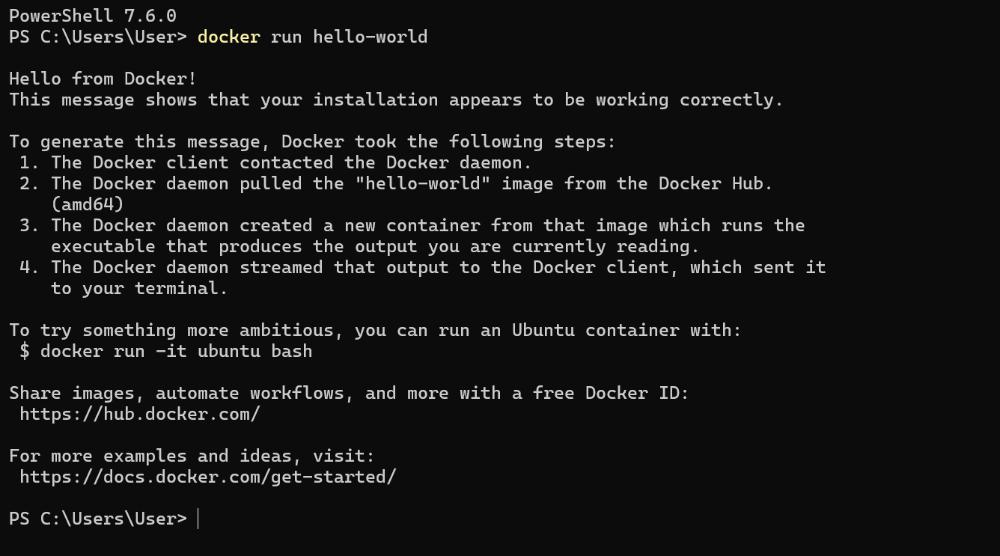
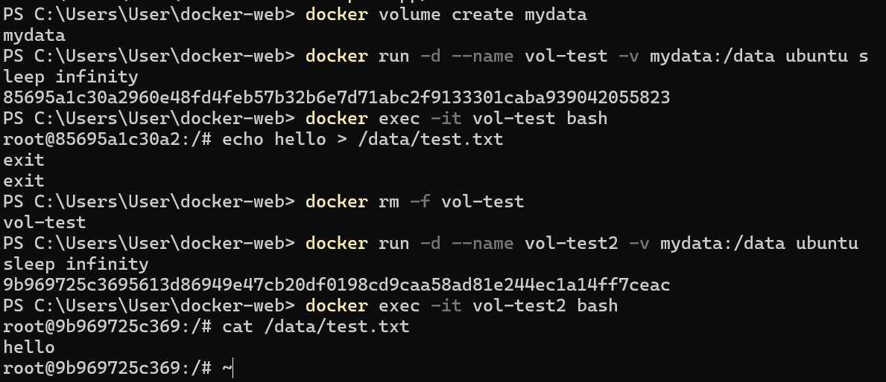

# Docker 기반 개발 환경 구축 실습

## 1. 프로젝트 개요
본 실습에서는 Docker를 활용하여 컨테이너 기반 개발 환경을 구축하였습니다.  
Docker 설치 및 실행 확인, Ubuntu 컨테이너 실행, Dockerfile을 이용한 이미지 생성,  
웹 서버 컨테이너 실행 및 포트 매핑, Bind Mount 실습, Docker Volume 영속성 실습을 진행하였습니다.  
추가로 Docker Compose, 환경 변수 활용, GitHub SSH 키 설정 보너스 과제도 수행하였습니다.  
실습 과정 전체를 GitHub Repository와 README 문서를 통해 정리하였습니다.

Docker를 이용하면 프로그램 실행 환경을 컨테이너로 관리할 수 있으며  
개발 환경을 동일하게 유지할 수 있다는 장점이 있습니다.  
이번 실습을 통해 Docker의 기본 구조와 동작 방식을 이해하는 것을 목표로 하였습니다.

---

## 2. 실행 환경

| 항목 | 내용 |
|------|------|
| OS | Windows 11 |
| Shell / Terminal | PowerShell 7.6.0 |
| Docker | Docker Desktop |
| Git | 2.x |
| Web Server | Nginx (alpine) |
| Language | HTML |

---

## 3. 수행 항목 체크리스트

**필수 항목**
- [x] 터미널 기본 조작 및 디렉토리 구성
- [x] 파일 / 디렉토리 권한 변경 실습
- [x] Docker 설치 및 점검 (`docker --version`, `docker info`)
- [x] hello-world 컨테이너 실행
- [x] Ubuntu 컨테이너 실행 및 내부 진입
- [x] Dockerfile 작성 및 커스텀 이미지 빌드
- [x] 웹 컨테이너 실행 및 포트 매핑 접속 확인
- [x] Bind Mount 실습 (호스트 변경 전/후 반영 확인)
- [x] Docker Volume 영속성 실습 (컨테이너 삭제 전/후 데이터 유지 확인)
- [x] 컨테이너 및 이미지 목록 확인 (`docker ps -a`, `docker images`)
- [x] Docker 운영 명령 수행 (`docker logs`, `docker stats`)
- [x] Git 설정 및 GitHub 연동

**보너스 항목**
- [x] Docker Compose 기초 (단일 서비스 실행)
- [x] Docker Compose 멀티 컨테이너 (nginx + ubuntu 2개 서비스)
- [x] Compose 운영 명령어 (`up`, `down`, `ps`, `logs`)
- [x] 환경 변수 활용 (`.env` 파일로 포트 변경)
- [x] GitHub SSH 키 설정 및 인증 확인

---

## 4. 터미널 기본 조작 로그

PowerShell에서 기본 디렉토리 탐색 및 파일 조작 명령어를 수행하였습니다.

```powershell
# 현재 위치 확인
PS C:\Users\User> pwd

# 목록 확인 (숨김 파일 포함)
PS C:\Users\User> ls -Force

# 작업 디렉토리 생성 및 이동
PS C:\Users\User> mkdir docker-web
PS C:\Users\User> cd docker-web

# 빈 파일 생성
PS C:\Users\User\docker-web> New-Item test.txt

# 파일 내용 확인
PS C:\Users\User\docker-web> cat Dockerfile

# 파일 복사, 이름 변경, 삭제
PS C:\Users\User\docker-web> cp test.txt test-copy.txt
PS C:\Users\User\docker-web> mv test-copy.txt renamed.txt
PS C:\Users\User\docker-web> rm renamed.txt
```

---

## 5. 파일 권한 실습

리눅스 환경(Ubuntu 컨테이너 내부)에서 파일 및 디렉토리 권한을 확인하고 변경하는 실습을 진행하였습니다.

### 권한 표기 규칙
- `r` (read, 4) / `w` (write, 2) / `x` (execute, 1)
- 세 자리씩 끊어서 **소유자 / 그룹 / 기타** 순서로 권한을 나타냄
- 예: `755` = 소유자(rwx=7), 그룹(r-x=5), 기타(r-x=5)
- 예: `644` = 소유자(rw-=6), 그룹(r--=4), 기타(r--=4)

```bash
# 파일 권한 확인
ls -l /data/test.txt

# 파일 권한 변경 (644 → 755)
chmod 755 /data/test.txt
ls -l /data/test.txt

# 디렉토리 권한 확인 및 변경
ls -ld /data
chmod 755 /data
ls -ld /data
```

---

## 6. Docker 설치 및 기본 점검

Docker가 정상적으로 설치되었는지 버전 및 데몬 동작 여부를 확인하였습니다.

```powershell
docker --version
docker info
```

`docker info` 명령어를 통해 Docker 데몬이 정상적으로 동작 중임을 확인하였습니다.

---

## 7. hello-world 실행

Docker가 정상적으로 설치되었는지 확인하기 위해 hello-world 컨테이너를 실행하였습니다.

```powershell
docker run hello-world
```



hello-world 컨테이너 실행을 통해 Docker 이미지 다운로드,  
컨테이너 생성 및 실행 과정이 정상적으로 이루어지는 것을 확인하였습니다.

---

## 8. Ubuntu 컨테이너 실행

Ubuntu 컨테이너를 실행하여 컨테이너 내부에서 리눅스 명령어를 실행해 보았습니다.

```bash
docker run -it ubuntu bash
ls
echo hello
exit
```


컨테이너 내부에서 파일 목록 확인 및 문자열 출력 명령어를 실행하였으며  
컨테이너 내부는 하나의 독립된 리눅스 환경처럼 동작한다는 것을 확인하였습니다.

### attach vs exec 차이 관찰

| 방식 | 설명 | exit 시 동작 |
|------|------|-------------|
| `docker attach` | 컨테이너의 메인 프로세스에 직접 연결 | 컨테이너 **종료** |
| `docker exec -it` | 실행 중인 컨테이너에 새 프로세스로 진입 | 컨테이너 **유지** |

---

## 9. Dockerfile 작성

웹 서버 컨테이너를 만들기 위해 Dockerfile을 작성하였습니다.

```dockerfile
FROM nginx:alpine
COPY app/ /usr/share/nginx/html/
```

- `FROM nginx:alpine` : nginx가 설치된 경량 리눅스 이미지를 베이스로 사용
- `COPY app/` : 로컬의 app 폴더를 nginx 웹 루트 경로로 복사하여 커스텀 페이지 제공


Dockerfile을 이용하면 원하는 실행 환경을 이미지로 만들어 재사용할 수 있습니다.

---

## 10. Docker 이미지 빌드

Dockerfile을 이용하여 웹 서버 이미지를 생성하였습니다.

```powershell
docker build -t my-web:1.0 .
```


`docker build` 명령어를 통해 Dockerfile을 기반으로 새로운 이미지를 생성하였습니다.

---

## 11. 웹 컨테이너 실행 및 포트 매핑

생성한 이미지를 이용하여 웹 컨테이너를 실행하였습니다.

```powershell
docker run -d -p 8080:80 --name my-web my-web:1.0
```

브라우저에서 아래 주소로 접속하여 웹 페이지가 정상적으로 실행되는 것을 확인하였습니다.

```
http://localhost:8080
```


### 포트 매핑이 필요한 이유

컨테이너는 기본적으로 **격리된 네트워크** 안에서 실행됩니다.  
`-p 8080:80` 옵션으로 호스트 PC의 8080 포트와 컨테이너 내부의 80 포트를 연결해야  
외부(브라우저)에서 컨테이너 안의 서비스에 접근할 수 있습니다.

---

## 12. Docker 운영 명령 수행

이미지 목록, 컨테이너 목록, 로그, 리소스 사용량을 확인하는 운영 명령어를 수행하였습니다.

```powershell
# 이미지 목록 확인
docker images

# 모든 컨테이너 목록 (종료된 컨테이너 포함)
docker ps -a

# 컨테이너 로그 확인
docker logs my-web

# 리소스 사용량 확인 (1회 출력 후 종료)
docker stats --no-stream
```


---

## 13. Bind Mount 실습

Bind Mount를 이용하여 호스트 PC의 폴더와 컨테이너 내부 폴더를 연결하였습니다.

```powershell
docker run -d -p 8082:80 -v ${PWD}/app:/usr/share/nginx/html nginx
```

`index.html` 파일을 수정한 후 브라우저를 새로고침하였을 때  
컨테이너 내부 웹 페이지 내용이 즉시 변경되는 것을 확인하였습니다.


Bind Mount는 호스트 PC와 컨테이너가 **동일한 파일을 실시간으로 공유**할 때 사용하는 기능입니다.  
개발 중 코드를 수정하면 컨테이너 재시작 없이 바로 반영되어 개발 효율이 높아집니다.

---

## 14. Docker Volume 영속성 실습

Docker Volume을 이용하여 컨테이너 데이터를 영구적으로 저장하는 실습을 진행하였습니다.

```powershell
# 볼륨 생성
docker volume create mydata

# 첫 번째 컨테이너에 볼륨 연결 및 데이터 기록
docker run -d --name vol-test -v mydata:/data ubuntu sleep infinity
docker exec -it vol-test bash
# 컨테이너 내부
echo hello > /data/test.txt
exit

# 첫 번째 컨테이너 삭제
docker rm -f vol-test

# 두 번째 컨테이너에 동일 볼륨 연결 후 데이터 확인
docker run -d --name vol-test2 -v mydata:/data ubuntu sleep infinity
docker exec -it vol-test2 bash
# 컨테이너 내부
cat /data/test.txt
# hello → 데이터 유지 확인
```



컨테이너를 삭제하더라도 볼륨에 저장된 데이터는 유지되는 것을 확인하였습니다.

### Bind Mount vs Docker Volume 비교

| 구분 | Bind Mount | Docker Volume |
|------|-----------|--------------|
| 저장 위치 | 호스트의 **지정 경로** | Docker가 관리하는 **내부 영역** |
| 주요 용도 | 개발 중 코드 실시간 반영 | DB, 로그 등 **영속 데이터** 보관 |
| 컨테이너 삭제 후 | 호스트 파일 유지 | 볼륨 별도 삭제 전까지 데이터 유지 |

---

## 15. Git 설정 및 GitHub 연동

Git 사용자 정보와 기본 브랜치를 설정하고 GitHub에 연동하였습니다.

```powershell
# 사용자 정보 설정
git config --global user.name "이름"
git config --global user.email "이메일@example.com"

# 기본 브랜치 설정
git config --global init.defaultBranch main

# 설정 전체 확인
git config --list
```

### Git과 GitHub의 역할 차이

| 구분 | Git | GitHub |
|------|-----|--------|
| 역할 | **로컬** 버전 관리 도구 | **원격** 협업 플랫폼 |
| 동작 위치 | 내 컴퓨터 | 클라우드 (웹) |
| 주요 기능 | 커밋, 브랜치, 히스토리 관리 | 원격 저장소, PR, 이슈, 팀 협업 |

---

## 16. Docker 구조 정리

Docker의 기본 구조는 다음과 같습니다.

```
Dockerfile → Image → Container → Port Mapping → Bind Mount → Volume
```

- **Dockerfile** : 이미지를 만들기 위한 설계도
- **Image** : 실행 가능한 환경이 패키징된 템플릿
- **Container** : 이미지를 기반으로 실행된 독립 환경
- **Port Mapping** : 외부(호스트)와 컨테이너 내부 포트 연결
- **Bind Mount** : 호스트 경로와 컨테이너 경로 실시간 연동
- **Volume** : Docker가 관리하는 영속 데이터 저장소

---

## 17. 트러블슈팅

### 트러블슈팅 1 — 포트 충돌로 컨테이너 실행 실패

**문제**  
`docker run -d -p 8080:80` 실행 시 아래 오류 발생:
```
Error response from daemon: Bind for 0.0.0.0:8080 failed: port is already allocated
```

**원인 가설**  
이미 8080 포트를 점유 중인 컨테이너 또는 다른 프로세스가 존재할 것이라 판단하였습니다.

**확인**  
```powershell
docker ps -a
netstat -ano | findstr :8080
```
이미 실행 중인 컨테이너가 8080 포트를 사용하고 있음을 확인하였습니다.

**해결**  
기존 컨테이너를 중지하거나, 다른 포트(8081)로 변경하여 실행하였습니다.
```powershell
docker stop my-web
docker run -d -p 8081:80 --name my-web2 my-web:1.0
```

---

### 트러블슈팅 2 — Bind Mount 경로 오류 (Windows PowerShell)

**문제**  
PowerShell에서 Bind Mount 실행 시 경로를 인식하지 못하는 문제가 발생하였습니다.
```
docker: invalid reference format
```

**원인 가설**  
Windows 경로 형식(`C:\Users\...`)을 Docker가 정상적으로 인식하지 못할 것이라 판단하였습니다.

**확인**  
`${PWD}` 를 직접 절대 경로로 입력해도 동일한 오류가 발생하였습니다.

**해결**  
PowerShell에서는 경로를 큰따옴표로 감싸 해결하였습니다.
```powershell
docker run -d -p 8082:80 -v "${PWD}/app:/usr/share/nginx/html" nginx
```

---

## 18. 검증 방법 요약

| 항목 | 검증 명령 | 확인 내용 |
|------|----------|----------|
| Docker 설치 | `docker --version` | 버전 출력 확인 |
| 데몬 동작 | `docker info` | 정상 응답 확인 |
| 이미지 빌드 | `docker images` | `my-web:1.0` 목록 확인 |
| 컨테이너 실행 | `docker ps` | STATUS = Up 확인 |
| 포트 매핑 | 브라우저 `localhost:8080` 접속 | 웹 페이지 정상 출력 확인 |
| Bind Mount | 파일 수정 후 브라우저 새로고침 | 변경 내용 즉시 반영 확인 |
| Volume 영속성 | 컨테이너 삭제 후 재생성, `cat /data/test.txt` | 데이터 유지 확인 |
| Git 설정 | `git config --list` | `user.name` / `user.email` 확인 |
| SSH 인증 | `ssh -T git@github.com` | 인증 성공 메시지 확인 |

---

## 19. 보너스 과제

### 19-1. Docker Compose 기초 (단일 서비스)

`docker-compose.yml` 파일을 작성하여 단일 nginx 서비스를 Compose로 실행하였습니다.

```yaml
version: '3'

services:
  web:
    image: nginx
    ports:
      - "8090:80"
```


```powershell
# Compose로 서비스 실행
docker compose up -d

# 실행 상태 확인
docker compose ps
```


**배움 포인트:**  
`docker run` 명령어로 매번 옵션을 입력하던 방식이 `docker-compose.yml`이라는 **문서화된 실행 설정**으로 바뀝니다.  
팀원 누구나 `docker compose up -d` 한 줄로 동일한 환경을 실행할 수 있어 재현성이 높아집니다.

---

### 19-2. Docker Compose 멀티 컨테이너

nginx 웹 서버와 ubuntu 2개의 서비스를 Compose로 함께 실행하였습니다.

```yaml
version: '3'

services:
  web:
    image: nginx
    ports:
      - "8091:80"
  ubuntu:
    image: ubuntu
    command: sleep infinity
```

```powershell
docker compose up -d
docker compose ps
```


`docker compose ps` 결과에서 `docker-web-ubuntu-1`과 `docker-web-web-1` 두 컨테이너가  
동시에 실행되는 것을 확인하였습니다.

**배움 포인트:**  
Compose로 띄운 서비스들은 자동으로 **같은 네트워크(`docker-web_default`)** 에 묶입니다.  
서비스 이름(예: `web`, `ubuntu`)을 호스트명처럼 사용하여 컨테이너 간 통신이 가능합니다.

---

### 19-3. Compose 운영 명령어

```powershell
# 서비스 실행
docker compose up -d

# 실행 중인 서비스 확인
docker compose ps

# 서비스 로그 확인
docker compose logs

# 서비스 종료 및 컨테이너 삭제
docker compose down
```


**배움 포인트:**  
`up / down / ps / logs` 네 가지 명령으로 서비스의 **실행 → 상태 확인 → 로그 확인 → 종료** 전체 사이클을 관리할 수 있습니다.

---

### 19-4. 환경 변수 활용 (.env 파일로 포트 변경)

`.env` 파일에 환경 변수를 정의하고 `docker-compose.yml`에서 참조하여 포트를 변경하였습니다.

**.env 파일**
```
PORT=8092
```


**docker-compose.yml**
```yaml
version: '3'

services:
  web:
    image: nginx
    ports:
      - "${PORT}:80"
```

```powershell
docker compose up -d
# localhost:8092 로 접속 확인
```


**배움 포인트:**  
포트, 환경 모드, DB 비밀번호 같은 **설정값을 코드에서 분리**할 수 있습니다.  
`.env` 파일만 바꾸면 환경(개발/스테이징/운영)별로 다른 설정을 적용할 수 있어  
실무에서 매우 널리 사용되는 패턴입니다.

---

### 19-5. GitHub SSH 키 설정

HTTPS 대신 SSH 방식으로 GitHub에 인증하도록 SSH 키를 생성하고 등록하였습니다.

```powershell
# SSH 키 생성
ssh-keygen -t ed25519 -C "이메일@example.com"

# 공개 키 확인 (GitHub에 등록할 키)
cat ~/.ssh/id_ed25519.pub

# SSH 인증 테스트
ssh -T git@github.com
```


`Hi clae-dev! You've successfully authenticated` 메시지를 통해 SSH 인증이 정상적으로 완료된 것을 확인하였습니다.

**HTTPS vs SSH 인증 방식 비교**

| 구분 | HTTPS | SSH |
|------|-------|-----|
| 인증 방식 | 아이디 / 토큰 입력 | 키 파일로 자동 인증 |
| 매번 인증 필요 | O (토큰 캐싱 전까지) | X (키 등록 후 자동) |
| 보안 | 토큰 노출 위험 | 개인키가 로컬에만 존재 |
| 실무 권장 | 일반적 사용 | **서버/자동화 환경 권장** |

---

## 20. 결론

이번 실습을 통해 Docker를 이용하여 컨테이너 기반 개발 환경을 구축하는 방법을 학습하였습니다.  
Dockerfile을 통해 이미지를 생성하고 컨테이너 실행, 포트 매핑, Bind Mount, Volume 기능을 실습하였습니다.  
추가로 Docker Compose를 통해 멀티 컨테이너 환경 구성과 환경 변수 분리, SSH 인증 방식까지 경험하였습니다.  
Docker는 개발 환경을 동일하게 유지하고 프로그램 실행 환경을 컨테이너로 관리할 수 있어  
개발 및 배포 환경에서 매우 유용하게 사용할 수 있다는 것을 확인하였습니다.
